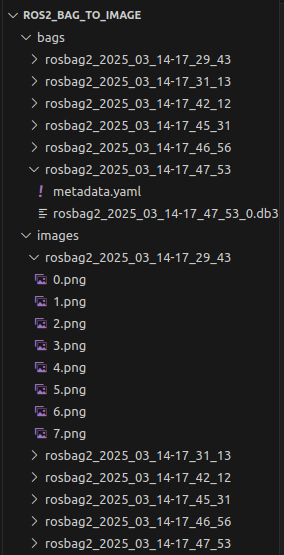
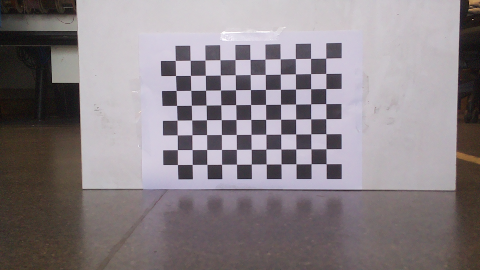

# ROS2 Bag To Image

This is a simple python package that provides two scripts to extract information, i.e. images and LiDAR scans, into offline files. 

# Option 1 - Barebone scripts for images and cloud

We first provide two barebone script that does the file extraction, for images and point clouds separately. 

The script for [image extraction](https://github.com/ACFR-RPG/ros2_bag_to_image/blob/main/ros2_bag_to_image/extract_images_from_bag.py) will read in a user-specified ROS bag, take all the image messages on topic `/camera/image_raw`, and save it without alternating its encoding to a user-designated directory. 

The script for [cloud extraction](https://github.com/ACFR-RPG/ros2_bag_to_image/blob/main/ros2_bag_to_image/extract_pointcloud_from_bag.py) will read in a user-specified ROS bag, take all the point cloud messages on topic `/pointcloud2d` or a user-specified one, and save it as `.pcd` format to a user-designated directory. 


## Usage

To use these script, simply run at the top directory level of this package folder: 
```
python ros2_bag_to_image/extract_images_from_bag.py <path/to/bag> <output/path>
python ros2_bag_to_image/extract_pointcloud_from_bag.py <path/to/bag> <output/path>
```

## Example

In this [Google Drive folder](https://drive.google.com/drive/folders/1pZpSstLPTSJcQ-2KaaZFc8NeBMKuVD_V), 
we provide a collection of example ROS bags for the purpose of calibrating the camera intrinsic as well as the camera-LiDAR extrinsic, each of which contains many camera views and LiDAR scans. 

Running the image extraction script mentioned above will generate an `/images` folder under the user-designated `/output/path` and extract all images in a bag into it in `.png` format, named using the timestamp of these images in the bag. 

Running the point cloud extraction script will create the `/output/path` and extract all point clouds in a bag into this directory in `.pcd` format, following a `cloud_<timestamp>.pcd` naming format. 

# Option 2 - ROS Node for images

We also provide a simple ROS2 node that opens bag files from `bags/`, looks for the topic `/camera/image_raw`, then saves the image to `/images` under the same bag name and image index, ordered by when the images are read by the bag. While completing this operation, the node will also publish the image to `/image` for real-time monitoring if necessary.

## Installation

To install, run the following code:

```
cd ~/ros2_ws/src
git clone https://github.com/ACFR-RPG/ros2_bag_to_image.git
cd ..
colcon build --packages-select ros2_bag_to_image
source install/setup.bash
```

## Usage

To use this package, place the ROS bags in `~/ros2_ws/src/ros2_bag_to_image/bags/` and delete `~/ros2_ws/src/ros2_bag_to_image/images/`. Ensure that the `$HOME` path variable is set correctly. Then, run the following:

```
ros2 run ros2_bag_to_image ros2_bag_to_image
```

## Example

By default, this package comes with a few ROS bags recorded from the TurtleBot3 burger robot, placed at various angles and distances relative to a checkerboard. After running, the following images will appear:

<p align="center">

</p>

Opening one of these images will look like:

<p align="center">

</p>

